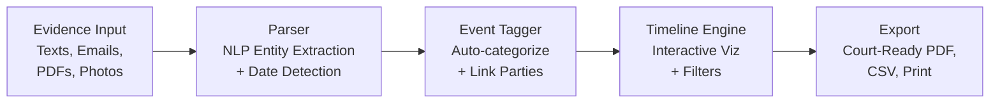

# Evidence Timeline Builder

**Turn chaos into clarity.**

## The Problem

Court evidence is scattered across texts, emails, PDFs, photos, and dozens of other formats. For self-represented litigants and under-resourced attorneys alike, organizing this mountain of information into a coherent narrative for court is nearly impossible. Critical evidence gets lost, timelines become muddled, and cases suffer -- not because the evidence doesn't exist, but because no one can make sense of it.

## The Solution

Evidence Timeline Builder lets you upload any evidence type, automatically tags events with dates, parties, and categories using NLP, and visualizes everything as an interactive timeline. When it's time for court, export polished, court-ready reports in seconds.



## Who This Helps

- **Self-represented parents** navigating custody disputes with years of text messages and emails
- **Family law attorneys** managing complex cases with hundreds of exhibits
- **Guardians ad litem** synthesizing evidence from multiple sources into clear recommendations
- **Domestic violence advocates** building protective order cases with thorough documentation
- **Mediators** who need a neutral, chronological view of disputed events

## Features

- **Multi-format evidence upload** -- text messages, emails, PDFs, images, and more
- **NLP-powered auto-tagging** of dates, parties, and events using entity extraction
- **Interactive timeline visualization** with filtering by date range, party, category, and evidence type
- **Court-ready export** -- generate polished PDF reports, CSV data, and print-friendly views
- **Evidence gap analysis** -- identify missing time periods or undocumented claims
- **Chain-of-custody tracking** -- maintain verifiable evidence integrity from upload to courtroom

## Quick Start

```bash
git clone https://github.com/dougdevitre/evidence-timeline.git
cd evidence-timeline
npm install
npm run dev
```

### Usage Example

```typescript
import { TextParser } from '@justice-os/evidence-timeline/parsers/text-parser';
import { TimelineEngine } from '@justice-os/evidence-timeline/timeline/engine';

// Parse a chat export
const parser = new TextParser();
const evidence = await parser.parse(chatExportText, {
  source: 'text-messages',
  format: 'bracketed-timestamp',
});

// Build a timeline
const engine = new TimelineEngine();
engine.addEvent({
  id: 'evt-001',
  evidenceId: evidence.id,
  date: new Date('2024-02-01'),
  parties: ['Alice', 'Bob'],
  category: 'incident',
  summary: 'Missed custody pickup',
  tags: ['custody'],
});

// Sort, filter, and export
const sorted = engine.sort();
const incidents = engine.filter({ categories: ['incident'] });
const report = engine.render({ format: 'pdf' });
```

See [`examples/build-timeline.ts`](./examples/build-timeline.ts) for a complete walkthrough.

## Roadmap

| Feature | Status |
|---------|--------|
| Multi-format evidence upload (text, email, PDF, image) | Done |
| NLP-powered date and entity extraction | In Progress |
| Interactive timeline visualization with zoom and pan | In Progress |
| Court-ready PDF/CSV export | Planned |
| Evidence gap analysis and warnings | Planned |
| Chain-of-custody audit trail | Planned |

## Architecture

See [`docs/architecture.md`](./docs/architecture.md) for detailed Mermaid diagrams covering the parser pipeline, NLP entity extraction, timeline rendering, and export flow.

## Contributing

See [CONTRIBUTING.md](./CONTRIBUTING.md) for guidelines.

## License

MIT -- see [LICENSE](./LICENSE) for details.

---

## Justice OS Ecosystem

This repository is part of the **Justice OS** open-source ecosystem — 32 interconnected projects building the infrastructure for accessible justice technology.

### Core System Layer
| Repository | Description |
|-----------|-------------|
| [justice-os](https://github.com/dougdevitre/justice-os) | Core modular platform — the foundation |
| [justice-api-gateway](https://github.com/dougdevitre/justice-api-gateway) | Interoperability layer for courts |
| [legal-identity-layer](https://github.com/dougdevitre/legal-identity-layer) | Universal legal identity and auth |
| [case-continuity-engine](https://github.com/dougdevitre/case-continuity-engine) | Never lose case history across systems |
| [offline-justice-sync](https://github.com/dougdevitre/offline-justice-sync) | Works without internet — local-first sync |

### User Experience Layer
| Repository | Description |
|-----------|-------------|
| [justice-navigator](https://github.com/dougdevitre/justice-navigator) | Google Maps for legal problems |
| [mobile-court-access](https://github.com/dougdevitre/mobile-court-access) | Mobile-first court access kit |
| [cognitive-load-ui](https://github.com/dougdevitre/cognitive-load-ui) | Design system for stressed users |
| [multilingual-justice](https://github.com/dougdevitre/multilingual-justice) | Real-time legal translation |
| [voice-legal-interface](https://github.com/dougdevitre/voice-legal-interface) | Justice without reading or typing |
| [legal-plain-language](https://github.com/dougdevitre/legal-plain-language) | Turn legalese into human language |

### AI + Intelligence Layer
| Repository | Description |
|-----------|-------------|
| [vetted-legal-ai](https://github.com/dougdevitre/vetted-legal-ai) | RAG engine with citation validation |
| [justice-knowledge-graph](https://github.com/dougdevitre/justice-knowledge-graph) | Open data layer for laws and procedures |
| [legal-ai-guardrails](https://github.com/dougdevitre/legal-ai-guardrails) | AI safety SDK for justice use |
| [emotional-intelligence-ai](https://github.com/dougdevitre/emotional-intelligence-ai) | Reduce conflict, improve outcomes |
| [ai-reasoning-engine](https://github.com/dougdevitre/ai-reasoning-engine) | Show your work for AI decisions |

### Infrastructure + Trust Layer
| Repository | Description |
|-----------|-------------|
| [evidence-vault](https://github.com/dougdevitre/evidence-vault) | Privacy-first secure evidence storage |
| [court-notification-engine](https://github.com/dougdevitre/court-notification-engine) | Smart deadline and hearing alerts |
| [justice-analytics](https://github.com/dougdevitre/justice-analytics) | Bias detection and disparity dashboards |
| [evidence-timeline](https://github.com/dougdevitre/evidence-timeline) | Evidence timeline builder |

### Tools + Automation Layer
| Repository | Description |
|-----------|-------------|
| [court-doc-engine](https://github.com/dougdevitre/court-doc-engine) | TurboTax for legal filings |
| [justice-workflow-engine](https://github.com/dougdevitre/justice-workflow-engine) | Zapier for legal processes |
| [pro-se-toolkit](https://github.com/dougdevitre/pro-se-toolkit) | Self-represented litigant tools |
| [justice-score-engine](https://github.com/dougdevitre/justice-score-engine) | Access-to-justice measurement |
| [justice-app-generator](https://github.com/dougdevitre/justice-app-generator) | No-code builder for justice tools |

### Quality + Testing Layer
| Repository | Description |
|-----------|-------------|
| [justice-persona-simulator](https://github.com/dougdevitre/justice-persona-simulator) | Test products against real human realities |
| [justice-experiment-lab](https://github.com/dougdevitre/justice-experiment-lab) | A/B testing for justice outcomes |

### Adoption Layer
| Repository | Description |
|-----------|-------------|
| [digital-literacy-sim](https://github.com/dougdevitre/digital-literacy-sim) | Digital literacy simulator |
| [legal-resource-discovery](https://github.com/dougdevitre/legal-resource-discovery) | Find the right help instantly |
| [court-simulation-sandbox](https://github.com/dougdevitre/court-simulation-sandbox) | Practice before the real thing |
| [justice-components](https://github.com/dougdevitre/justice-components) | Reusable component library |
| [justice-dev-starter-kit](https://github.com/dougdevitre/justice-dev-starter-kit) | Ultimate boilerplate for justice tech builders |

> Built with purpose. Open by design. Justice for all.


---

### ⚠️ Disclaimer

This project is provided for **informational and educational purposes only** and does **not** constitute legal advice, legal representation, or an attorney-client relationship. No warranty is made regarding accuracy, completeness, or fitness for any particular legal matter. **Always consult a licensed attorney** in your jurisdiction before making legal decisions. Use of this software does not create any professional-client relationship.

---

### Built by Doug Devitre

I build AI-powered platforms that solve real problems. I also speak about it.

**[CoTrackPro](https://cotrackpro.com)** · admin@cotrackpro.com

→ **Hire me:** AI platform development · Strategic consulting · Keynote speaking

> *AWS AI/Cloud/Dev Certified · UX Certified (NNg) · Certified Speaking Professional (NSA)*
> *Author of Screen to Screen Selling (McGraw Hill) · 100,000+ professionals trained*
