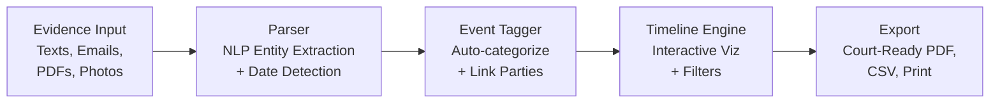

# Evidence Timeline Builder

**Turn chaos into clarity.**

## The Problem

Court evidence is scattered across texts, emails, PDFs, photos, and dozens of other formats. For self-represented litigants and under-resourced attorneys alike, organizing this mountain of information into a coherent narrative for court is nearly impossible. Critical evidence gets lost, timelines become muddled, and cases suffer -- not because the evidence doesn't exist, but because no one can make sense of it.

## The Solution

Evidence Timeline Builder lets you upload any evidence type, automatically tags events with dates, parties, and categories using NLP, and visualizes everything as an interactive timeline. When it's time for court, export polished, court-ready reports in seconds.



## Who This Helps

- **Self-represented parents** navigating custody disputes with years of text messages and emails
- **Family law attorneys** managing complex cases with hundreds of exhibits
- **Guardians ad litem** synthesizing evidence from multiple sources into clear recommendations
- **Domestic violence advocates** building protective order cases with thorough documentation
- **Mediators** who need a neutral, chronological view of disputed events

## Features

- **Multi-format evidence upload** -- text messages, emails, PDFs, images, and more
- **NLP-powered auto-tagging** of dates, parties, and events using entity extraction
- **Interactive timeline visualization** with filtering by date range, party, category, and evidence type
- **Court-ready export** -- generate polished PDF reports, CSV data, and print-friendly views
- **Evidence gap analysis** -- identify missing time periods or undocumented claims
- **Chain-of-custody tracking** -- maintain verifiable evidence integrity from upload to courtroom

## Getting Started

```bash
git clone https://github.com/dougdevitre/evidence-timeline.git
cd evidence-timeline
npm install
npm run dev
```

## Contributing

See [CONTRIBUTING.md](./CONTRIBUTING.md) for guidelines.

## License

MIT -- see [LICENSE](./LICENSE) for details.
