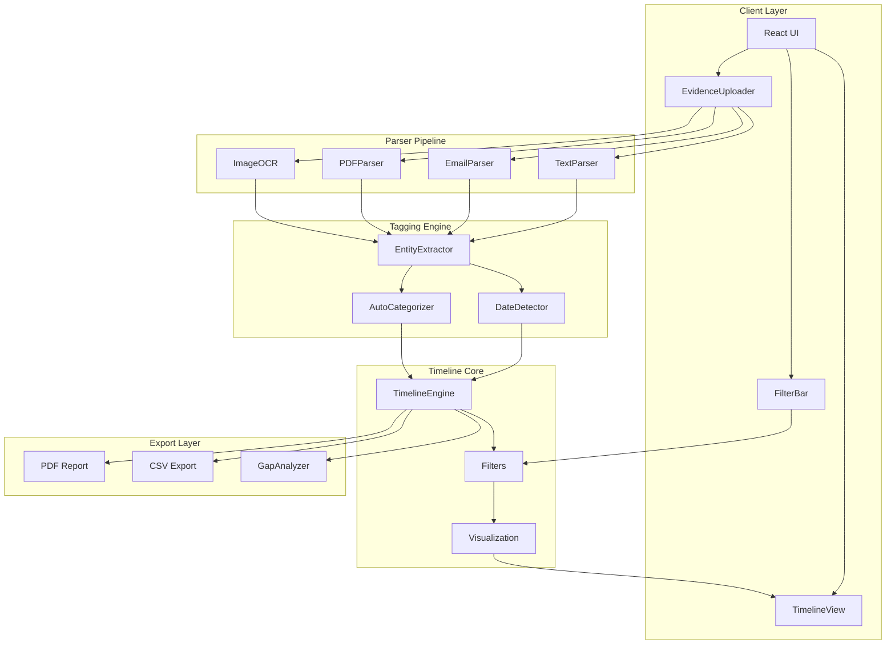
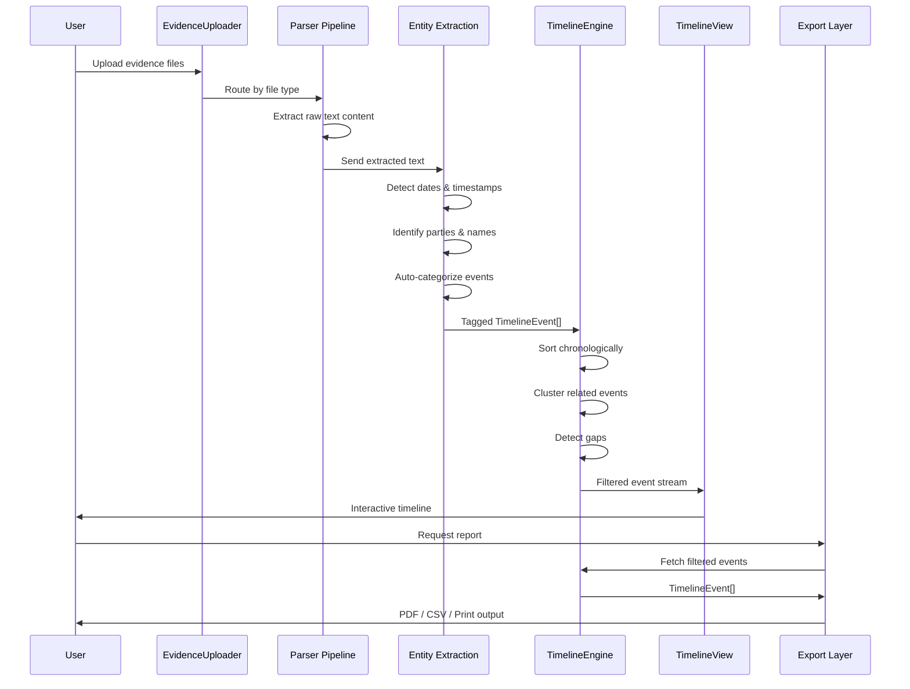
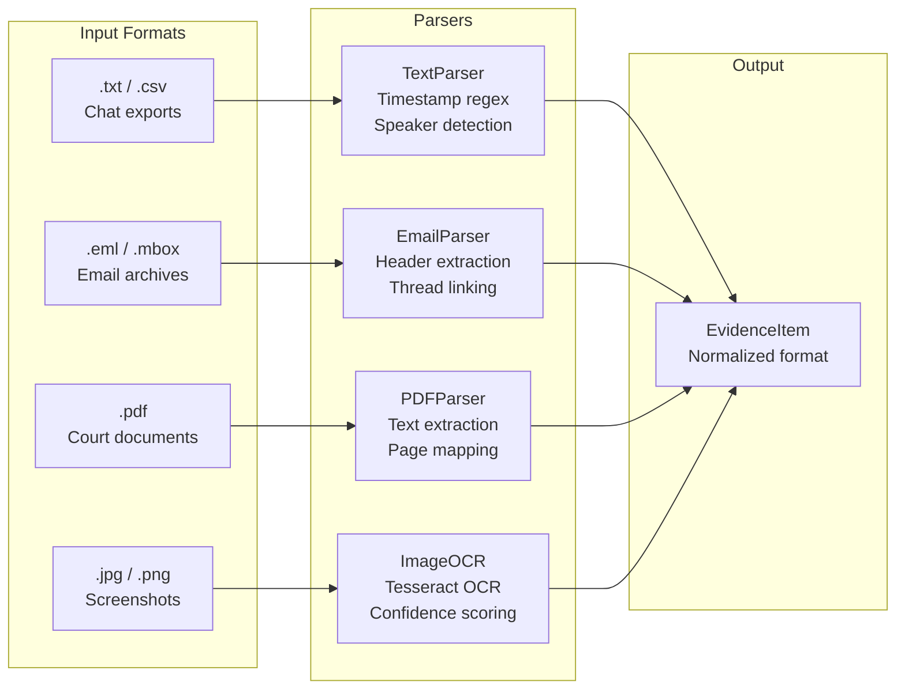
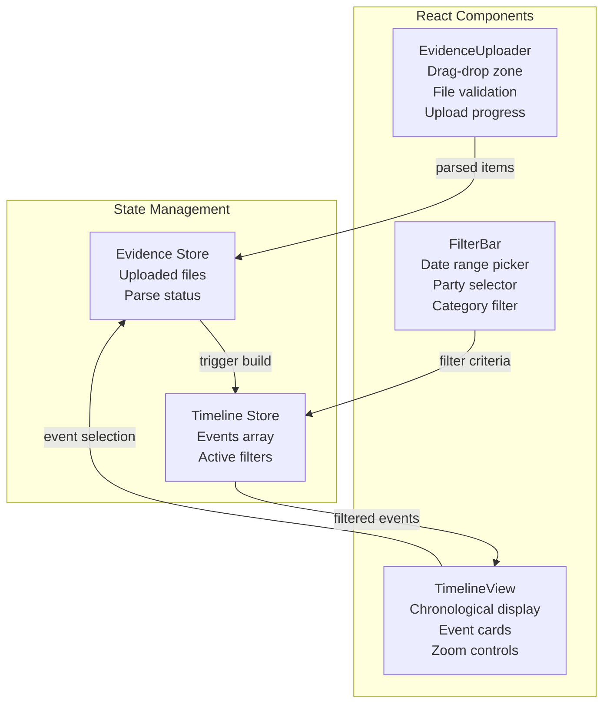
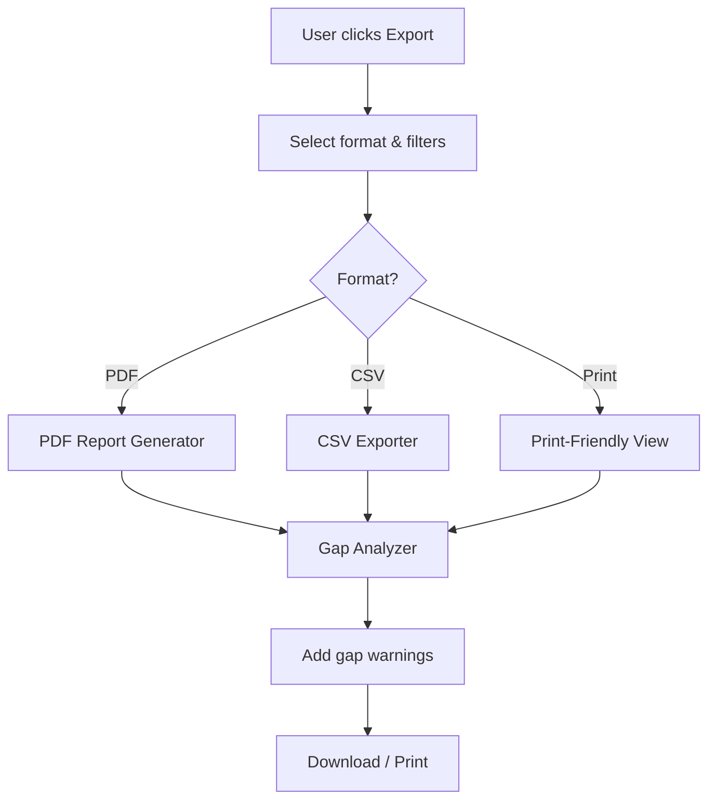

# Evidence Timeline Builder -- Architecture

## System Overview

```mermaid
graph TB
    subgraph "Client Layer"
        UI[React UI]
        EV[EvidenceUploader]
        TV[TimelineView]
        FB[FilterBar]
    end

    subgraph "Parser Pipeline"
        TP[TextParser]
        EP[EmailParser]
        PP[PDFParser]
        IO[ImageOCR]
    end

    subgraph "Tagging Engine"
        EE[EntityExtractor]
        DD[DateDetector]
        AC[AutoCategorizer]
    end

    subgraph "Timeline Core"
        TE[TimelineEngine]
        TF[Filters]
        VZ[Visualization]
    end

    subgraph "Export Layer"
        PR[PDF Report]
        CE[CSV Export]
        GA[GapAnalyzer]
    end

    UI --> EV
    UI --> TV
    UI --> FB

    EV --> TP
    EV --> EP
    EV --> PP
    EV --> IO

    TP --> EE
    EP --> EE
    PP --> EE
    IO --> EE

    EE --> DD
    EE --> AC

    DD --> TE
    AC --> TE

    TE --> TF
    TF --> VZ
    VZ --> TV

    FB --> TF

    TE --> PR
    TE --> CE
    TE --> GA
```

## Data Flow

```mermaid
sequenceDiagram
    participant User
    participant Uploader as EvidenceUploader
    participant Parser as Parser Pipeline
    participant NLP as Entity Extraction
    participant Engine as TimelineEngine
    participant View as TimelineView
    participant Export as Export Layer

    User->>Uploader: Upload evidence files
    Uploader->>Parser: Route by file type
    Parser->>Parser: Extract raw text content
    Parser->>NLP: Send extracted text
    NLP->>NLP: Detect dates & timestamps
    NLP->>NLP: Identify parties & names
    NLP->>NLP: Auto-categorize events
    NLP->>Engine: Tagged TimelineEvent[]
    Engine->>Engine: Sort chronologically
    Engine->>Engine: Cluster related events
    Engine->>Engine: Detect gaps
    Engine->>View: Filtered event stream
    View->>User: Interactive timeline

    User->>Export: Request report
    Export->>Engine: Fetch filtered events
    Engine->>Export: TimelineEvent[]
    Export->>User: PDF / CSV / Print output
```

## Parser Pipeline Detail

```mermaid
graph LR
    subgraph "Input Formats"
        TXT[".txt / .csv<br/>Chat exports"]
        EML[".eml / .mbox<br/>Email archives"]
        PDF[".pdf<br/>Court documents"]
        IMG[".jpg / .png<br/>Screenshots"]
    end

    subgraph "Parsers"
        TP[TextParser<br/>Timestamp regex<br/>Speaker detection]
        EP[EmailParser<br/>Header extraction<br/>Thread linking]
        PP[PDFParser<br/>Text extraction<br/>Page mapping]
        IO[ImageOCR<br/>Tesseract OCR<br/>Confidence scoring]
    end

    subgraph "Output"
        EI[EvidenceItem<br/>Normalized format]
    end

    TXT --> TP --> EI
    EML --> EP --> EI
    PDF --> PP --> EI
    IMG --> IO --> EI
```

## Component Interaction

```mermaid
graph TD
    subgraph "React Components"
        EU[EvidenceUploader<br/>Drag-drop zone<br/>File validation<br/>Upload progress]
        FB[FilterBar<br/>Date range picker<br/>Party selector<br/>Category filter]
        TV[TimelineView<br/>Chronological display<br/>Event cards<br/>Zoom controls]
    end

    subgraph "State Management"
        ES[Evidence Store<br/>Uploaded files<br/>Parse status]
        TS[Timeline Store<br/>Events array<br/>Active filters]
    end

    EU -->|"parsed items"| ES
    ES -->|"trigger build"| TS
    FB -->|"filter criteria"| TS
    TS -->|"filtered events"| TV
    TV -->|"event selection"| ES
```

## Export Flow

```mermaid
flowchart TD
    Start[User clicks Export] --> Config[Select format & filters]
    Config --> Format{Format?}

    Format -->|PDF| PDF[PDF Report Generator]
    Format -->|CSV| CSV[CSV Exporter]
    Format -->|Print| Print[Print-Friendly View]

    PDF --> Gap[Gap Analyzer]
    CSV --> Gap
    Print --> Gap

    Gap --> Review[Add gap warnings]
    Review --> Output[Download / Print]
```
